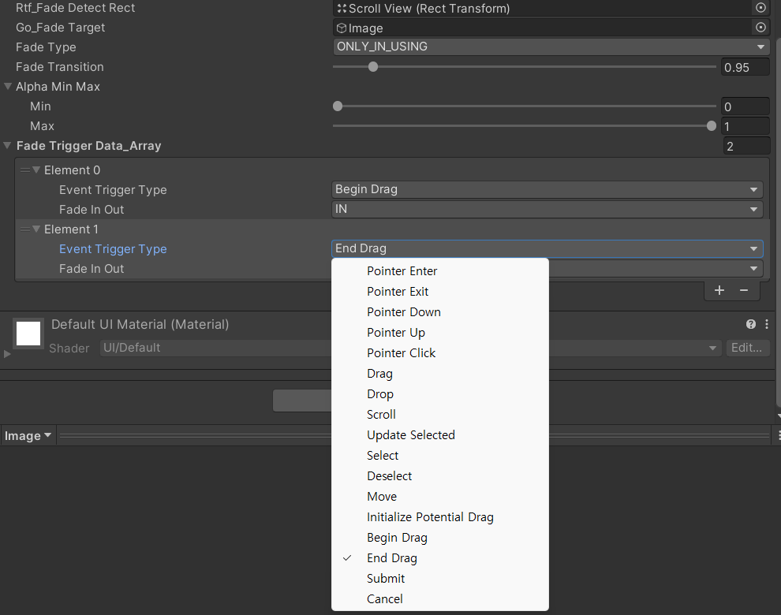

# FadeInOutMask

## Description
- 이벤트 트리거를 통해 특정 UI의 Fade In 혹은 Fade Out을 통제하기 위해 제작
- Fade Trigger Data Array에 추가한 각 동작을 Start 함수에서 감지용 오브젝트의 EventTrigger컴포넌트에 추가

## Visual
>[자료 영상(Youtube)](https://youtu.be/f9bWg0IHd6g)

