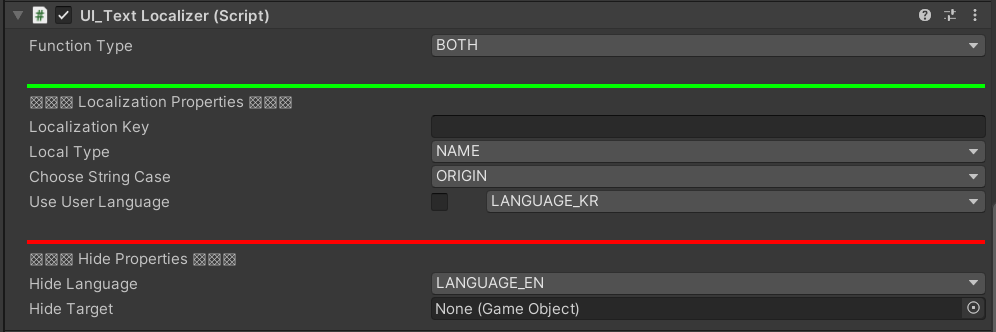
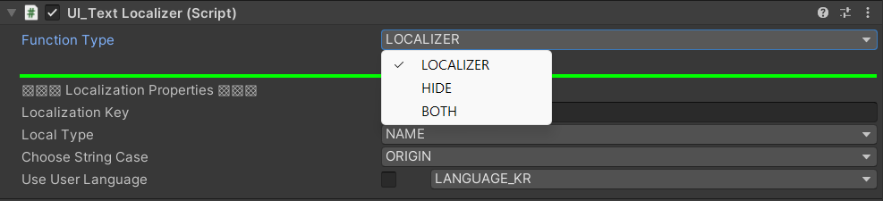
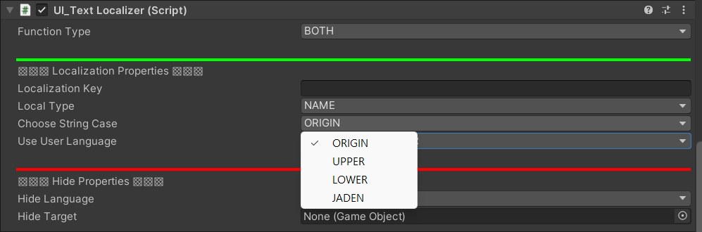
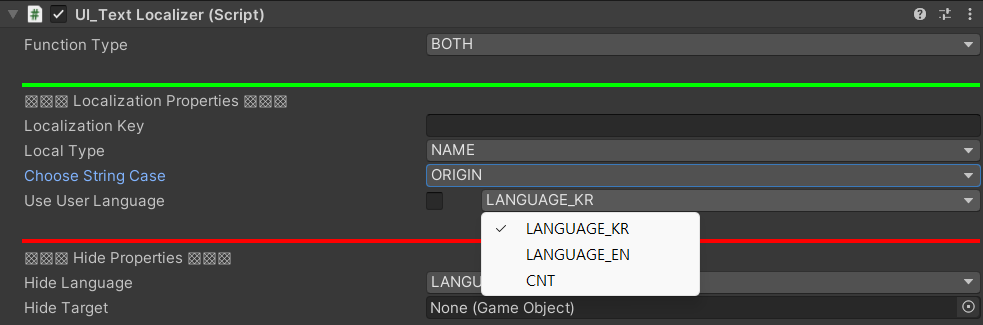

# Text Localizer

## Description
- 각 국가 언어 별 로컬라이징을 위한 컴포넌트 스크립트
- 예를 들어, 다음과 같은 데이터 테이블에서 Key_Button이라는 키값을 통해 언어 설정에 따라 '버튼' 혹은 'Button'등이 출력

Data Table
|Key            |Kr          |Eng          |
|---------------|------------|-------------|
|Key_Button     |버튼        |Button       |

## Visual
>
>
>
>