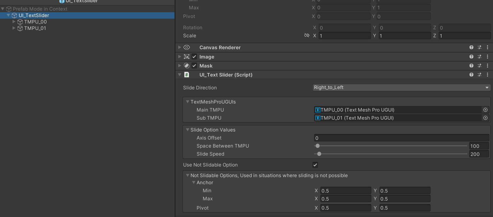
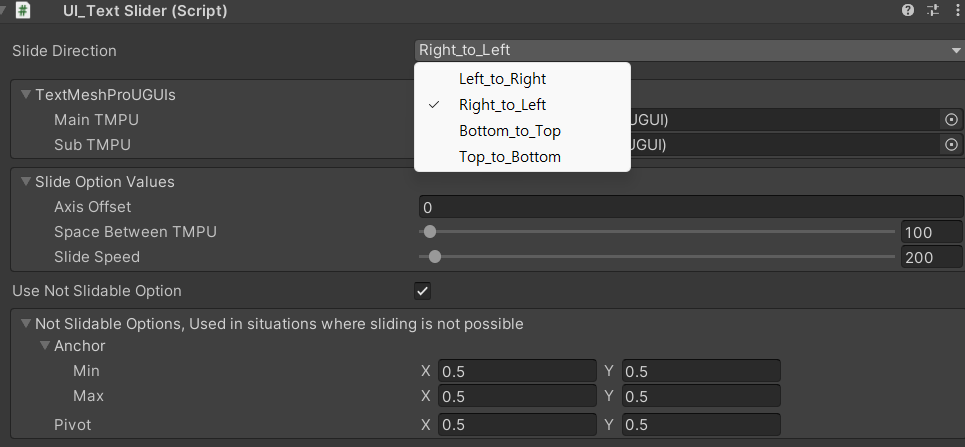

# TextSlider

## Description
- TextMeshPro 용
- 텍스트 오브젝트의 뷰 영역보다 입력할 텍스트가 길어질 경우, 자동으로 텍스트가 슬라이드가 되도록 제작
- TextMeshPro 이벤트 매니저의 TEXT_CHANGED_EVENT에 텍스트 변환 이벤트 함수를 등록하여 텍스트 입력을 감지

## Visual
>[자료 영상(Youtube)](https://youtu.be/sT9e3z5biAk)

