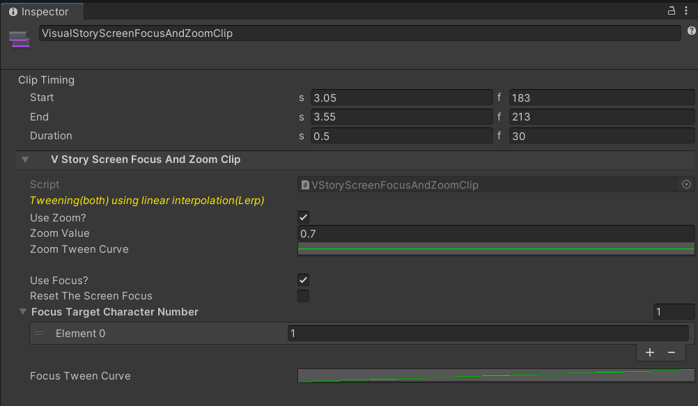
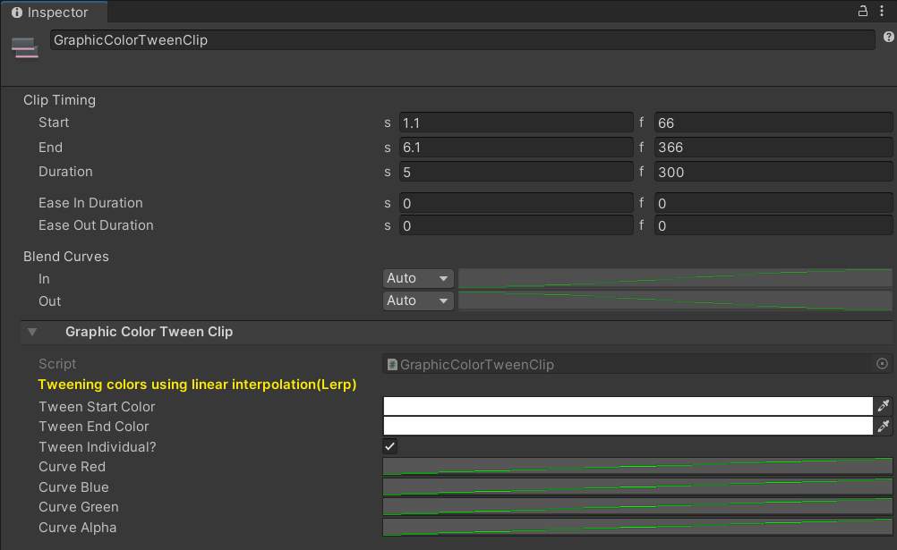
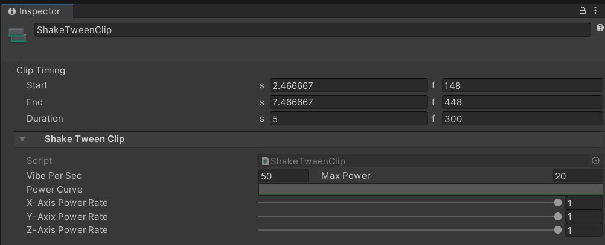

# Visual Story

## Description
- 게임 내 콘텐츠 중 하나로, 게임 이용자가 비주얼 노블 형식으로 스토리 컨텐츠를 체험할 수 있도록 하는 것이 목적
- Timeline을 활용하였으며, 추가적으로 Default Playables와 DoTween에셋을 사용
- 개발자는 컨텐츠에 필요한 기능에 맞춰 환경과 트랙을 제공해주고, 이를 기반으로 컨텐츠 담당 제작자가 원하는 연출을 마음껏 넣고 조정해 볼 수 있도록 개발

## Visual
>Customized Track List 

>Track Inspector Examples 

